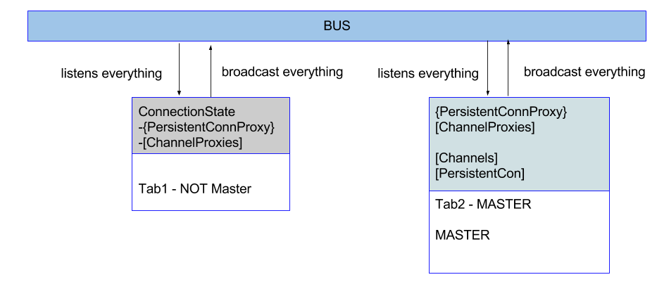

# Solution Summary

1. Build a bus inside PersistenConnProxy constructor so that tabs can communicate
2. PersistenConnProxy will return an object that mimics PersistentConn with an identical prototype "signature" so that the PersistentConnProxy can replace PersistentConn with on changes in code
3. unsubscribe, subscribe and disconnect will be broadcasted to the bus instead of directly executed by PersistentConn.
4. A ChannelProxy object will be returned by the subscribe function. it has the same prototype "signature" as the Channel class.
5. bin, bind_all, unbind and unbind_all will also be broadcasted to the bus and the callback will be bind to the bus
6. All tabs will listen to "subscribe", "unsubscribe" and "disconnect", bind, unbind, bind_all, unbind_all events on the bus (including it's own events emmited)
7. Master tab will execute the real operations using a "singleton" PersistentConn object (only the master tab contains a PersistentConn object)
8. Master tab will listen to all events on PersistentConn and broadcast (forward) it to the bus. The events received by PersistenConn/Channel will be broadcasted to the bus with the type "channelName_eventName"  
9. Slave tabs will keep a "ConnectionState" (self.conn) object that is updated for each subscribe, unsubscribe, bind, bind_all,unbind,unbind_all event 
10. When the master tab changes (masterDidChange event), the "ConnectionState" object is used to recreate the connection and all the current subscription/channels and bindings.
11. Channel class inside persistent_conn_proxy.js implements a function that emmits all the registered events each 5 seconds so the behavior of PersistenConnProxy and PersistentConn can be simulated/tested
12. the object window.mock.isconnected is used to simulate a disconnection and so new events are not emmited
13. Evemit is used to simulate event emmits in Channel class - https://github.com/Nicolab/evemit
14. Files test_persistent_conn_mock.html and test_persistent_conn_proxy.html are identical test files with the only difference that test_persistent_conn_mock.html uses PersistentConn and test_persistent_conn_proxy.html uses PersistentConnProxy
15. Files test_persistent_conn_mock.html and test_persistent_conn_proxy.html proves that the only thing necessary to solve the original problem is to replace the PersistentConn with PersistenConnProxy in a single line of code
16. Files test_persistent_conn_mock.html and test_persistent_conn_proxy.html can be used to test the solution by creating channels and bindings with the HTML interface on it

 